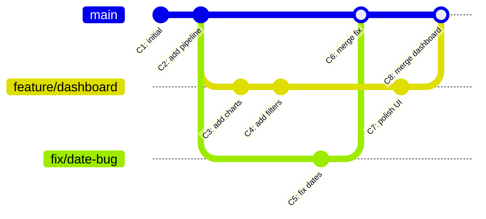
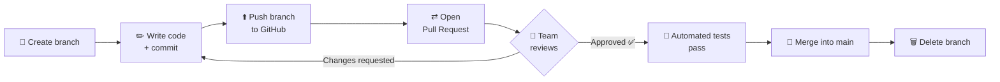

# 🚀 GitHub for Absolute Beginners — The Complete Guide

> A zero-to-hero README that explains **Git & GitHub from scratch** — what it is, why it exists, how to set it up, and every command you'll actually use. Written so that someone who has *never* touched version control can follow along.

---

## 📑 Table of Contents

1. [What is GitHub? (and what is Git?)](#1-what-is-github-and-what-is-git)
2. [A Little History — When Was It Founded?](#2-a-little-history--when-was-it-founded)
3. [The Core Problem GitHub Solves](#3-the-core-problem-github-solves)
4. [Where Do We Use GitHub?](#4-where-do-we-use-github)
5. [GitHub UI Tour](#5-github-ui-tour)
6. [Initial Setup — From Repo Creation to Clone](#6-initial-setup--from-repo-creation-to-clone)
7. [Authentication — Personal & Team Accounts](#7-authentication--personal--team-accounts)
8. [The Core Workflow — Add, Commit, Push, Pull](#8-the-core-workflow--add-commit-push-pull)
9. [Branches — Explained Simply](#9-branches--explained-simply)
10. [Merging (and Merge Conflicts)](#10-merging-and-merge-conflicts)
11. [Visual Representation of How Git Works](#11-visual-representation-of-how-git-works)
12. [VS Code Setup for Git & GitHub](#12-vs-code-setup-for-git--github)
13. [Branching Strategies](#13-branching-strategies)
14. [How the GitHub Workflow Works (Pull Requests)](#14-how-the-github-workflow-works-pull-requests)
15. [Git Command Cheat Sheet](#15-git-command-cheat-sheet)
16. [Common Mistakes & How to Fix Them](#16-common-mistakes--how-to-fix-them)
17. [Glossary of Terms](#17-glossary-of-terms)

---

## 1. What is GitHub? (and what is Git?)

Before understanding **GitHub**, you must understand **Git** — they are **two different things**.

### 🧩 Git — The Tool

**Git** is a **Version Control System (VCS)** — a free program installed on *your computer* that:

- 📸 Takes **snapshots** of your project every time you save a version (called a *commit*)
- ⏪ Lets you **travel back in time** to any previous version
- 👥 Lets **multiple people** work on the same project **without overwriting** each other's work

Think of Git like the **"Save Game"** feature in a video game — you can save your progress at any checkpoint and load any old save whenever you want.

### ☁️ GitHub — The Website

**GitHub** is a **cloud platform (website)** that **hosts your Git projects online** so that:

- 🌍 Your code is **backed up** on the internet (not just your laptop)
- 🤝 Your **team can access it** from anywhere
- 🔍 Others can **review, comment, and contribute** to your code
- 🤖 You can automate testing & deployment (CI/CD with GitHub Actions)

### 🎯 The Simplest Analogy

| Concept | Analogy |
|---|---|
| **Git** | MS Word's "Track Changes" + "Version History" — but for code, on your computer |
| **GitHub** | Google Drive — the cloud where the document lives so others can see & collaborate |
| **Repository (repo)** | A project folder |
| **Commit** | A saved checkpoint / snapshot with a note describing what changed |
| **Push** | Uploading your checkpoints to the cloud |
| **Pull** | Downloading the latest checkpoints from the cloud |
| **Branch** | A parallel copy of the project where you can experiment safely |
| **Merge** | Combining your experiment back into the main project |

> 💡 **Remember:** Git works even without the internet. GitHub is just the *online home* for Git projects. (Alternatives: GitLab, Bitbucket, Azure DevOps.)

---

## 2. A Little History — When Was It Founded?

| Milestone | Year | Details |
|---|---|---|
| **Git created** | **2005** | Created by **Linus Torvalds** (creator of Linux) to manage Linux kernel development |
| **GitHub founded** | **February 2008** | Founded by **Tom Preston-Werner, Chris Wanstrath, PJ Hyett & Scott Chacon** in San Francisco |
| **Microsoft acquisition** | **2018** | Microsoft acquired GitHub for **$7.5 billion** |
| **Today** | 2020s | GitHub hosts **hundreds of millions of repositories** used by **100+ million developers** — the largest code-hosting platform in the world |

---

## 3. The Core Problem GitHub Solves

### 😱 Life *Before* Version Control

Imagine a team of 5 developers working on one project **without Git**:

```
project_final.zip
project_final_v2.zip
project_final_v2_REAL.zip
project_final_v2_REAL_johns_changes.zip
project_FINAL_FINAL_use_this_one.zip   😵
```

**Problems this creates:**

| # | Problem | Real-world pain |
|---|---|---|
| 1 | **Overwriting work** | Two people edit the same file → one person's work is lost |
| 2 | **No history** | "The app broke yesterday — what changed?" → nobody knows |
| 3 | **No backup** | Laptop crashes → the entire project is gone |
| 4 | **No accountability** | Who wrote this buggy line? Impossible to tell |
| 5 | **Painful collaboration** | Emailing zip files back and forth, merging changes by copy-paste |
| 6 | **Fear of experimenting** | "If I try this new feature and it breaks, I can't undo it" |

### ✅ How Git + GitHub Solves Each Problem

| Problem | Solution |
|---|---|
| Overwriting work | **Branches** — everyone works in their own isolated copy, then merges |
| No history | **Commits** — every change is recorded with *who, what, when, and why* |
| No backup | **Remote repository** — code lives safely in the cloud on GitHub |
| Painful collaboration | **Push / Pull + Pull Requests** — structured, reviewable teamwork |
| Fear of experimenting | **Branches + revert** — experiment freely; you can always go back |

> 🧠 **In one sentence:** Git + GitHub gives you a **time machine + collaboration hub + backup system** for your code.

---

## 4. Where Do We Use GitHub?

GitHub is not only for software developers:

| Field | Usage |
|---|---|
| 💻 **Software Development** | Hosting, reviewing & shipping application code |
| 📊 **Data Engineering / Data Science** | Versioning ETL pipelines, SQL scripts, dbt models, Airflow DAGs, notebooks, Terraform/IaC |
| 🤖 **Machine Learning / AI** | Sharing models, experiment configs, research code |
| 📚 **Documentation** | READMEs, wikis, technical docs (this file itself is a README!) |
| 🌐 **Open Source** | Linux, Python, React, TensorFlow, VS Code — all developed publicly on GitHub |
| 🚀 **DevOps / CI-CD** | GitHub Actions automate testing & deployment |
| 🎓 **Education & Portfolios** | Your GitHub profile is your **developer resume** — recruiters look at it! |
| ✍️ **Writing / Configs** | Books, blogs, dotfiles, infrastructure configs |

---

## 5. GitHub UI Tour

When you open **github.com** and log in, here's what you'll see:

### 🏠 A) The Home Page (Dashboard)

```
┌────────────────────────────────────────────────────────────────┐
│  🐙 GitHub   [🔍 Search]        [+ ▾]  [🔔]  [👤 Your Avatar]  │
├──────────────┬─────────────────────────────────┬───────────────┤
│  LEFT PANEL  │        CENTER FEED              │  RIGHT PANEL  │
│              │                                 │               │
│ Your repos   │  Activity from people/repos     │  Trending     │
│ (quick list) │  you follow                     │  repos,       │
│              │                                 │  suggestions  │
└──────────────┴─────────────────────────────────┴───────────────┘
```

- **`+` button (top-right):** create a new repository, import a repo, create a gist or organization
- **🔔 Bell:** notifications (someone commented, mentioned you, requested a review)
- **Avatar menu:** Your profile, Your repositories, **Settings** (important for authentication!)

### 📁 B) Inside a Repository Page

```
┌────────────────────────────────────────────────────────────────────┐
│  username / repository-name          👁 Watch   🍴 Fork   ⭐ Star  │
├────────────────────────────────────────────────────────────────────┤
│ <> Code | ⊙ Issues | ⇄ Pull requests | ▶ Actions | 📋 Projects |  │
│ 📖 Wiki | 🛡 Security | 📈 Insights | ⚙ Settings                  │
├────────────────────────────────────────────────────────────────────┤
│  🌿 main ▾   [🔍 Go to file]  [+ Add file ▾]  [<> Code ▾ (green)] │
│  ──────────────────────────────────────────────────────────────    │
│  📂 src/                    latest commit message      2 days ago  │
│  📂 data/                   fix pipeline bug           5 days ago  │
│  📄 README.md               initial commit             1 week ago  │
│  📄 .gitignore              initial commit             1 week ago  │
│  ──────────────────────────────────────────────────────────────    │
│  📖 README.md  ← rendered automatically below the file list        │
└────────────────────────────────────────────────────────────────────┘
```

**What each tab means (in plain English):**

| Tab | What it's for |
|---|---|
| **`<> Code`** | The files in your project — the default view |
| **`⊙ Issues`** | A to-do list / bug tracker — anyone can report bugs or request features |
| **`⇄ Pull requests`** | Proposed changes waiting for review before merging ("Hey team, please review my code") |
| **`▶ Actions`** | Automation — run tests / deploy automatically when code changes (CI/CD) |
| **`📋 Projects`** | Kanban boards for planning work (like Trello inside GitHub) |
| **`📖 Wiki`** | Extended documentation pages |
| **`🛡 Security`** | Vulnerability alerts and security policies |
| **`📈 Insights`** | Graphs: contributors, commit frequency, traffic |
| **`⚙ Settings`** | Rename repo, manage collaborators, branch protection, delete repo |

**Other key buttons:**

| Button | Meaning |
|---|---|
| **⭐ Star** | Bookmark / "like" a repo |
| **🍴 Fork** | Make your own personal copy of someone else's repo |
| **👁 Watch** | Get notified about all activity in the repo |
| **🌿 Branch dropdown** | Switch between branches (versions) of the code |
| **🟢 Code button** | Get the URL to **clone** (download) the repo |

---

## 6. Initial Setup — From Repo Creation to Clone

### Step 0 — Install Git & Create a GitHub Account

1. **Download Git:** <https://git-scm.com/downloads> → install with default options
2. **Verify installation** (open Terminal / Git Bash / PowerShell):
   ```bash
   git --version
   # Example output: git version 2.45.0
   ```
3. **Create a GitHub account:** <https://github.com/signup>

### Step 1 — Tell Git Who You Are (one-time setup)

Every commit is stamped with your name & email, so Git needs to know you:

```bash
git config --global user.name  "Your Name"
git config --global user.email "your-email@example.com"

# Recommended extras:
git config --global init.defaultBranch main   # use 'main' as default branch
git config --global core.editor "code --wait" # use VS Code as Git's editor

# Verify:
git config --list
```

> ⚠️ Use the **same email** you registered on GitHub — otherwise your commits won't be linked to your profile (no green squares! 🟩).

### Step 2 — Create a Repository on GitHub

1. Click the **`+`** icon (top-right) → **New repository**
2. Fill in:
   - **Repository name:** e.g., `my-first-repo` (use hyphens, no spaces)
   - **Description:** optional, one line about the project
   - **Visibility:** 🔓 **Public** (anyone can view) or 🔒 **Private** (only you & invited people)
   - ✅ Check **"Add a README file"** (recommended — lets you clone immediately)
   - **.gitignore:** choose a template (e.g., `Python`) — tells Git which files to *never* track (logs, venv, credentials)
   - **License:** e.g., MIT (for open source)
3. Click **Create repository** 🎉

### Step 3 — Clone the Repo (download it to your computer)

**Cloning = downloading the repo + its full history + a live link to GitHub.**

1. On the repo page, click the green **`<> Code`** button
2. Copy the URL (HTTPS or SSH — see [Authentication](#7-authentication--personal--team-accounts))
3. In your terminal:

```bash
# Navigate to where you keep projects
cd ~/projects

# Clone (HTTPS example)
git clone https://github.com/your-username/my-first-repo.git

# Enter the project folder
cd my-first-repo

# Check the link to GitHub was created automatically
git remote -v
# origin  https://github.com/your-username/my-first-repo.git (fetch)
# origin  https://github.com/your-username/my-first-repo.git (push)
```

> 💡 **`origin`** is just a nickname for the GitHub URL of your repo. It's the default name Git gives to the remote you cloned from.

### 🔁 Alternative: Start Locally, Then Connect to GitHub

If your project already exists on your laptop:

```bash
cd my-existing-project
git init                          # 1. Turn the folder into a Git repo
git add .                         # 2. Stage all files
git commit -m "Initial commit"    # 3. First snapshot
git branch -M main                # 4. Name the branch 'main'
git remote add origin https://github.com/your-username/my-repo.git   # 5. Link to GitHub
git push -u origin main           # 6. Upload
```

---

## 7. Authentication — Personal & Team Accounts

> 🔥 **This is where most beginners get stuck.** GitHub **no longer accepts your account password** for `git push` (removed in August 2021). You must use a **Personal Access Token (PAT)** or **SSH keys**.

### The 3 Ways to Authenticate

| Method | Best for | Difficulty | How it works |
|---|---|---|---|
| **HTTPS + Personal Access Token (PAT)** | Beginners, personal use | ⭐ Easy | Token acts as your password |
| **SSH Keys** | Daily development, teams | ⭐⭐ Medium | Cryptographic key pair — no passwords ever again |
| **GitHub CLI (`gh`)** | Fastest modern setup | ⭐ Easy | Browser-based login, handles everything |

---

### 🔑 Option A — HTTPS + Personal Access Token (PAT)

1. GitHub → click your **avatar** → **Settings**
2. Scroll to **Developer settings** (bottom of left sidebar)
3. **Personal access tokens → Fine-grained tokens → Generate new token**
4. Set: a name, an **expiry date**, select repositories, and permissions (**Contents: Read & Write** is the key one)
5. **Copy the token immediately** — it is shown ONLY ONCE! (looks like `github_pat_XXXX...`)
6. Next time Git asks for credentials:
   - **Username:** your GitHub username
   - **Password:** **paste the TOKEN** (not your real password!)

**Save it so you're never asked again (credential helper):**

```bash
# Windows (built into Git for Windows):
git config --global credential.helper manager

# macOS (uses Keychain):
git config --global credential.helper osxkeychain

# Linux:
git config --global credential.helper store   # stores in plain text file
```

---

### 🗝️ Option B — SSH Keys (recommended for daily work & teams)

**Concept:** You generate a *key pair* — a **private key** (stays secret on your laptop) and a **public key** (uploaded to GitHub). They mathematically match, so GitHub knows it's you — no passwords, ever.

```bash
# 1. Generate a key pair (press Enter to accept defaults)
ssh-keygen -t ed25519 -C "your-email@example.com"

# 2. Start the ssh-agent & add your key
eval "$(ssh-agent -s)"
ssh-add ~/.ssh/id_ed25519

# 3. Copy the PUBLIC key
cat ~/.ssh/id_ed25519.pub
# copy the whole output (starts with ssh-ed25519 ...)
```

4. GitHub → **Settings → SSH and GPG keys → New SSH key** → paste → save
5. **Test it:**

```bash
ssh -T git@github.com
# Hi your-username! You've successfully authenticated...
```

6. Now always clone with the **SSH URL**:

```bash
git clone git@github.com:your-username/my-repo.git
```

> 🔁 Already cloned with HTTPS? Switch to SSH:
> ```bash
> git remote set-url origin git@github.com:your-username/my-repo.git
> ```

---

### ⚡ Option C — GitHub CLI (easiest modern way)

```bash
# Install from https://cli.github.com then:
gh auth login
# → choose GitHub.com → HTTPS or SSH → Login with a web browser
# Done! git push/pull now just works.
```

---

### 👥 Authentication in a TEAM (Organization) Setting

| Concern | What to do |
|---|---|
| **Getting access** | An org **owner/admin invites you**: Repo → Settings → Collaborators & teams (or org-level Teams). You accept the email invite. |
| **Roles/permissions** | Org repos have roles: **Read → Triage → Write → Maintain → Admin**. You need **Write** to push. |
| **SSO (company GitHub)** | If your org uses **SAML SSO**, you must **Authorize** your PAT/SSH key for that org: Settings → Developer settings → your token → *Configure SSO* → Authorize. **Forgetting this is the #1 cause of "push rejected" in companies.** |
| **PAT scope** | For fine-grained PATs, set **Resource owner = the organization**, not your personal account. |
| **2FA** | Most orgs require Two-Factor Authentication — enable it: Settings → Password and authentication. |
| **Branch protection** | Teams usually **block direct pushes to `main`** — if your push to main is rejected, that's intentional: create a branch + Pull Request instead. |
| **Multiple accounts** (work + personal) | Use different SSH keys per account with an `~/.ssh/config` file, or set per-repo identity: `git config user.email "work-email@company.com"` (without `--global`, inside the work repo). |

**Quick troubleshooting table:**

| Error you see | Likely cause | Fix |
|---|---|---|
| `Authentication failed` | Using your GitHub password | Use a PAT or SSH instead |
| `remote: Permission denied (403)` | No Write access / SSO not authorized | Ask admin for Write role; authorize SSO on your token |
| `Permission denied (publickey)` | SSH key not added to GitHub/agent | `ssh-add` your key; add public key in GitHub Settings |
| `Support for password authentication was removed` | Literally using account password | Create a PAT (Option A) |
| Push to `main` rejected | Branch protection rule | Push a feature branch and open a Pull Request |

---

## 8. The Core Workflow — Add, Commit, Push, Pull

### 🧠 First, Understand the 4 "Areas" of Git

Every file in a Git project lives in one of these areas:

```
 YOUR COMPUTER (Local)                                  CLOUD (GitHub)
┌─────────────────────────────────────────────────┐   ┌──────────────┐
│                                                 │   │              │
│  ① WORKING          ② STAGING        ③ LOCAL    │   │  ④ REMOTE    │
│  DIRECTORY          AREA (Index)     REPOSITORY │   │  REPOSITORY  │
│                                                 │   │              │
│  Files you are  →   Files marked  →  Saved      │ → │  Backed-up   │
│  editing right      "ready to be     snapshots  │   │  snapshots   │
│  now                saved"           (commits)  │   │  on GitHub   │
│                                                 │   │              │
└─────────────────────────────────────────────────┘   └──────────────┘
        └── git add ──┘  └─ git commit ─┘  └──── git push ────┘
                                           ┌──── git pull ────┐
                                           ▼                  │
                                     (updates ①②③ from ④) ────┘
```

**Analogy — Taking a group photo 📸:**
1. **Working directory** = people wandering around the room
2. **`git add`** = calling specific people to stand in front of the camera (staging)
3. **`git commit`** = 📸 *click!* — the photo is taken and saved in the album
4. **`git push`** = uploading the album to the cloud so everyone can see it
5. **`git pull`** = downloading photos your friends uploaded

### 🔄 The Daily Cycle (memorize this!)

```bash
# ── START OF DAY ──────────────────────────────────────
git pull origin main            # ⬇️  Get the latest code from GitHub FIRST

# ── DO YOUR WORK ──────────────────────────────────────
# ... edit files, create files, delete files ...

git status                      # 👀 See what changed (use this constantly!)
git diff                        # 🔍 See the exact line-by-line changes

# ── SAVE YOUR WORK ────────────────────────────────────
git add report.sql              # ➕ Stage ONE specific file
git add .                       # ➕ OR stage EVERYTHING that changed

git commit -m "Add daily sales report query"   # 📸 Snapshot with a message

# ── SHARE YOUR WORK ───────────────────────────────────
git push origin main            # ⬆️  Upload commits to GitHub
```

### Each Command Explained Like You're Five

| Command | Plain-English meaning |
|---|---|
| `git status` | "Git, what's going on right now?" — shows modified/staged/untracked files |
| `git add <file>` | "Include this file in my next snapshot" |
| `git add .` | "Include *everything* I changed in my next snapshot" |
| `git commit -m "msg"` | "Take the snapshot and label it with this message" |
| `git push` | "Upload my snapshots to GitHub" |
| `git pull` | "Download & apply everyone else's snapshots from GitHub" |
| `git log --oneline` | "Show me the album of all snapshots" |
| `git diff` | "Show me exactly which lines changed" |

### ✍️ Writing Good Commit Messages

```bash
# ❌ Bad (nobody knows what these mean later)
git commit -m "fix"
git commit -m "changes"
git commit -m "asdfgh"

# ✅ Good (imperative mood: "Add", "Fix", "Update", "Remove")
git commit -m "Add customer churn ETL pipeline"
git commit -m "Fix null handling in date parser"
git commit -m "Update README with setup instructions"
```

> 📏 **Rule of thumb:** A commit message should complete the sentence *"If applied, this commit will …"*

---

## 9. Branches — Explained Simply

### 🌳 What is a Branch?

A **branch** is a **parallel universe of your code**. You can experiment, build features, and break things in your universe — the `main` universe stays safe and untouched until you deliberately **merge** your work back.

```
                          ┌── C4 ── C5          ← branch: feature/login
                          │         │
main:  C1 ── C2 ── C3 ────┴─────────▼─── C6     ← C6 = merge commit
                                   merge
```

- Every repo starts with one branch: **`main`** (older repos call it `master`)
- `main` should always hold **working, stable code**
- New work happens on **feature branches**, then gets merged into `main`

**Analogy:** `main` = the published book 📖. A branch = a photocopy of the book you scribble edits on ✏️. Merging = the editor accepting your edits into the next printing.

### 🛠️ Branch Commands

```bash
git branch                          # 📋 List branches (* marks current one)
git branch feature/login            # ➕ Create a branch (but stay where you are)
git switch feature/login            # 🔀 Move to that branch
git switch -c feature/login         # ➕🔀 Create AND switch in one step (most common)
git switch main                     # 🏠 Go back to main
git branch -d feature/login         # 🗑️ Delete a branch (after merging)
git push -u origin feature/login    # ⬆️ Publish your branch to GitHub (first time)
```

> ℹ️ You'll also see `git checkout -b feature/login` in older tutorials — it does the same as `git switch -c`. `switch` is the newer, clearer command.

### 🏷️ Branch Naming Conventions

| Prefix | Use for | Example |
|---|---|---|
| `feature/` | New functionality | `feature/user-auth` |
| `bugfix/` or `fix/` | Fixing bugs | `fix/null-pointer-dashboard` |
| `hotfix/` | Urgent production fixes | `hotfix/payment-crash` |
| `release/` | Preparing a release | `release/v2.1.0` |
| `chore/` | Maintenance, cleanup | `chore/update-dependencies` |

---

## 10. Merging (and Merge Conflicts)

### 🤝 What is Merging?

**Merging = combining the commits of one branch into another.**

```bash
git switch main                 # 1. Go to the branch that RECEIVES the changes
git pull origin main            # 2. Make sure main is up to date
git merge feature/login         # 3. Bring feature/login's commits INTO main
git push origin main            # 4. Upload the merged result
```

### The 2 Types of Merges

**1) Fast-forward merge** — `main` didn't change while you worked, so Git simply slides the pointer forward. No extra commit created.

```
Before:  main: C1 ── C2
                      └── C3 ── C4   (feature)

After:   main: C1 ── C2 ── C3 ── C4   ✅ pointer just moved forward
```

**2) Three-way merge** — both branches moved, so Git creates a **merge commit** combining them.

```
Before:  main:    C1 ── C2 ── C5
                         └── C3 ── C4   (feature)

After:   main:    C1 ── C2 ── C5 ── C6 (merge commit)
                         └── C3 ── C4 ──┘
```

### ⚔️ Merge Conflicts — Don't Panic!

A **conflict** happens when **two branches changed the SAME LINES of the SAME FILE**. Git can't decide who wins, so it asks *you*.

When it happens, the file will look like this:

```text
<<<<<<< HEAD
price = quantity * 10        ← the version in YOUR current branch
=======
price = quantity * 12        ← the version from the branch being merged
>>>>>>> feature/pricing
```

**How to resolve (3 steps):**

```bash
# 1. Open the file, DELETE the <<<<<<< ======= >>>>>>> markers,
#    and keep the correct code (yours, theirs, or a mix).

# 2. Stage the fixed file
git add pricing.py

# 3. Finish the merge
git commit -m "Merge feature/pricing, resolve price conflict"
```

> 💡 **VS Code makes this painless** — it shows the conflict with clickable buttons: *Accept Current | Accept Incoming | Accept Both*.
>
> 🛡️ **Prevention:** pull often, keep branches short-lived, and don't let two people edit the same file simultaneously if avoidable.

---

## 11. Visual Representation of How Git Works

### 🗺️ The Big Picture — All Commands on One Map

```
        LOCAL MACHINE                                        GITHUB (CLOUD)
┌──────────────────────────────────────────────────────┐   ┌────────────────┐
│                                                      │   │                │
│  Working Dir      Staging Area      Local Repo       │   │  Remote Repo   │
│  ┌─────────┐      ┌─────────┐      ┌─────────┐       │   │  ┌─────────┐   │
│  │ file.py │      │ file.py │      │ commits │       │   │  │ commits │   │
│  │ (edited)│      │ (staged)│      │ history │       │   │  │ history │   │
│  └────┬────┘      └────┬────┘      └────┬────┘       │   │  └────┬────┘   │
│       │   git add      │   git commit   │            │   │       │        │
│       ├───────────────►├───────────────►│  git push  │   │       │        │
│       │                │                ├────────────────────────►│        │
│       │                │                │  git fetch │   │        │        │
│       │                │                │◄────────────────────────┤        │
│       │◄───────────────┴────────────────┤            │   │        │        │
│       │        git pull (fetch + merge) │◄───────────────────────┘        │
│       │                                 │            │   │                │
│       │◄────────────────────────────────┤            │   │                │
│       │   git checkout / restore        │            │   │                │
└──────────────────────────────────────────────────────┘   └────────────────┘
```

### 🌿 A Full Team Workflow, Visualized (Mermaid)

> GitHub renders these diagrams automatically in your README!



### 🔁 The Pull Request Lifecycle (Mermaid)



---

## 12. VS Code Setup for Git & GitHub

VS Code has **Git built in** — you can do 90% of Git work without typing commands.

### 🧰 Step-by-Step Setup

1. **Install VS Code:** <https://code.visualstudio.com>
2. **Install Git** (VS Code uses the Git you installed in Step 0)
3. **Sign in to GitHub inside VS Code:** click the **👤 Accounts icon** (bottom-left) → *Sign in with GitHub* → authorize in browser. Now clone/push/pull "just works" — no tokens to manage manually.
4. **Recommended extensions** (Ctrl/Cmd + Shift + X):

| Extension | Why |
|---|---|
| **GitLens** | See who changed each line & when (inline blame), rich history |
| **GitHub Pull Requests** | Create & review PRs without leaving VS Code |
| **Git Graph** | Beautiful visual tree of branches & commits |
| **GitHub Copilot** *(optional, paid)* | AI code suggestions |

### 🖱️ Using Git Visually in VS Code

```
┌──────────────────────────────────────────────┐
│ ACTIVITY BAR (left edge)                     │
│  📄 Explorer                                 │
│  🔍 Search                                   │
│  🌿 Source Control  ← ALL GIT ACTIONS HERE   │
│      badge shows number of changed files     │
├──────────────────────────────────────────────┤
│ SOURCE CONTROL PANEL                         │
│  Message box: [type commit message here]     │
│  [✓ Commit]  (dropdown: Commit & Push)       │
│                                              │
│  ▼ Changes                                   │
│     M  etl_pipeline.py     [+ to stage]      │
│     U  new_report.sql      [+ to stage]      │
│  ▼ Staged Changes                            │
│     M  README.md                             │
├──────────────────────────────────────────────┤
│ STATUS BAR (bottom)                          │
│  🌿 main  ⟳ 1↓ 2↑   ← branch + sync arrows  │
└──────────────────────────────────────────────┘
```

| GUI action | Equivalent command |
|---|---|
| Click **`+`** next to a file | `git add file` |
| Type message → **Commit** | `git commit -m "msg"` |
| **Sync Changes 🔄** button | `git pull` then `git push` |
| Click branch name (bottom-left) | `git switch` / create branch |
| Click a modified file | `git diff` (side-by-side view!) |
| `...` menu → Clone | `git clone` |

**File markers:** `M` = Modified, `U` = Untracked (new), `D` = Deleted, `A` = Added (staged).

> ⌨️ Open the built-in terminal anytime with **Ctrl + `** to run raw Git commands.

---

## 13. Branching Strategies

A **branching strategy** is a team agreement on *how* branches are created, named, and merged.

### Strategy 1 — GitHub Flow (⭐ simplest, best for beginners & most teams)

```
main ────●────────●──────●────────●───►   (always deployable)
          \      /        \      /
           ●──●─           ●──●─
        feature/a         fix/b
```

**Rules:** `main` is always deployable → branch off `main` → commit → open PR → review → merge → delete branch. That's it.

### Strategy 2 — Git Flow (structured, for versioned releases)

```
main     ─────────●─────────────●───►  (production releases only, tagged v1.0, v1.1)
                 /             /
release  ───────●──────●──────●        (release prep/stabilization)
               /      /
develop  ●───●───●───●───●───●───►     (integration branch)
          \     / \         /
           ●──●    ●──●───●
         feature/x   feature/y

hotfix   main ──●── back to main + develop  (urgent prod fixes)
```

**Branches:** `main`, `develop`, `feature/*`, `release/*`, `hotfix/*`. Powerful but heavy — used for software with scheduled releases (e.g., mobile apps, packaged software).

### Strategy 3 — Trunk-Based Development (used by big tech / elite DevOps teams)

Everyone commits to `main` (the "trunk") directly or via **very short-lived branches (< 1 day)**. Requires strong automated testing + feature flags.

### 📊 Which Should You Use?

| Strategy | Complexity | Best for |
|---|---|---|
| **GitHub Flow** | 🟢 Low | Web apps, data teams, startups, continuous deployment — **start here** |
| **Git Flow** | 🔴 High | Scheduled/versioned releases, multiple supported versions |
| **Trunk-Based** | 🟡 Medium (needs mature CI) | Large teams with excellent test automation |

---

## 14. How the GitHub Workflow Works (Pull Requests)

The **Pull Request (PR)** is the heart of teamwork on GitHub. It means:

> *"I've finished my work on a branch. Please **review** my changes and, if they look good, **pull** them into `main`."*

### 🔄 The Complete Team Workflow, Step by Step

```bash
# 1️⃣ Sync — always start fresh
git switch main
git pull origin main

# 2️⃣ Branch — create your isolated workspace
git switch -c feature/sales-dashboard

# 3️⃣ Work — edit, then commit (small, frequent commits!)
git add .
git commit -m "Add sales dashboard with monthly KPIs"

# 4️⃣ Push — publish your branch to GitHub
git push -u origin feature/sales-dashboard
```

```
# 5️⃣ Open a Pull Request (on github.com)
#    GitHub shows a yellow banner: "feature/sales-dashboard had recent pushes"
#    → Click [Compare & pull request]
#    → base: main  ◄─ compare: feature/sales-dashboard
#    → Write a title + description (what & why), add Reviewers
#    → [Create pull request]

# 6️⃣ Review
#    Teammates comment on specific lines, request changes, or Approve ✅
#    You push more commits to the same branch — the PR updates automatically

# 7️⃣ Merge (green button on the PR) — 3 options:
#    • Merge commit  → keeps every commit + adds a merge commit
#    • Squash & merge → combines ALL your commits into ONE clean commit (most popular)
#    • Rebase & merge → replays commits on top of main (linear history)

# 8️⃣ Clean up
git switch main
git pull origin main
git branch -d feature/sales-dashboard
```

### 🍴 Fork Workflow (for Open Source)

When you **don't have write access** to a repo (e.g., contributing to pandas):

```
1. Fork the repo (your own copy on GitHub)  →  2. Clone YOUR fork
3. Branch + commit + push to YOUR fork      →  4. Open a PR from your fork to the original repo
```

### 🛡️ Branch Protection (why you "can't push to main")

Teams configure **Settings → Branches → Branch protection rules** on `main`:
- ✅ Require a Pull Request before merging
- ✅ Require 1–2 approvals
- ✅ Require status checks (tests) to pass
- ❌ Block force pushes & direct commits

This is **a feature, not a bug** — it keeps production code safe.

---

## 15. Git Command Cheat Sheet

### ⚙️ Setup & Config
```bash
git --version                                # check Git is installed
git config --global user.name  "Your Name"  # set identity
git config --global user.email "you@x.com"
git config --list                            # view all settings
```

### 📁 Create & Clone
```bash
git init                          # turn current folder into a Git repo
git clone <url>                   # download a repo (HTTPS or SSH)
git remote -v                     # list linked remotes
git remote add origin <url>       # link local repo to GitHub
git remote set-url origin <url>   # change the remote URL
```

### 📸 Daily Snapshot Work
```bash
git status                        # what changed? (your best friend)
git diff                          # unstaged line changes
git diff --staged                 # staged line changes
git add <file>                    # stage one file
git add .                         # stage everything
git restore --staged <file>       # unstage (keep your edits)
git commit -m "message"           # snapshot staged files
git commit -am "message"          # add+commit tracked files in one step
```

### ⬆️⬇️ Sync with GitHub
```bash
git pull origin main              # download + merge latest changes
git fetch                         # download only (don't merge yet)
git push origin main              # upload commits
git push -u origin <branch>       # push new branch + set upstream (first time)
```

### 🌿 Branches
```bash
git branch                        # list local branches
git branch -a                     # list local + remote branches
git switch -c <branch>            # create + switch
git switch <branch>               # switch
git merge <branch>                # merge <branch> into current branch
git branch -d <branch>            # delete merged branch
git push origin --delete <branch> # delete branch on GitHub
```

### 🕰️ History & Inspection
```bash
git log --oneline                 # compact history
git log --oneline --graph --all   # visual branch tree in terminal
git show <commit-id>              # details of one commit
git blame <file>                  # who last changed each line
```

### 🚑 Undo & Rescue (use carefully!)
```bash
git restore <file>                # ⚠️ discard uncommitted edits to a file
git commit --amend -m "new msg"   # fix the LAST commit message (before pushing)
git revert <commit-id>            # ✅ SAFE undo: new commit that reverses an old one
git reset --soft HEAD~1           # undo last commit, KEEP changes staged
git reset --hard HEAD~1           # ☠️ undo last commit AND delete the changes
git stash                         # 📦 shelve uncommitted work temporarily
git stash pop                     # 📤 bring shelved work back
git reflog                        # 🦸 history of EVERYTHING — recover "lost" commits
```

> 🥇 **Golden rules of undoing:**
> 1. If it's **pushed/shared** → use `git revert` (safe).
> 2. If it's **local only** → `git reset` is fine.
> 3. Never `git push --force` to a shared branch.

### 🙈 .gitignore — Files Git Should Never Track
```gitignore
# Example .gitignore for a data project
__pycache__/
*.pyc
.venv/
venv/
.env                # 🔐 SECRETS — never commit credentials!
*.log
.ipynb_checkpoints/
data/raw/           # large data files don't belong in Git
.DS_Store
```

> 🔐 **Never commit passwords, API keys, or tokens.** If you accidentally do, the key is compromised — **rotate it immediately** (removing it from history isn't enough; assume it's leaked).

---

## 16. Common Mistakes & How to Fix Them

| 😅 Situation | 🛠️ Fix |
|---|---|
| Committed to the wrong branch | `git reset --soft HEAD~1` → `git switch correct-branch` → commit again |
| Typo in last commit message | `git commit --amend -m "correct message"` (only if not pushed) |
| Forgot a file in the last commit | `git add file` → `git commit --amend --no-edit` |
| Want to undo a pushed commit | `git revert <commit-id>` (creates a safe "opposite" commit) |
| Need to switch branches mid-work | `git stash` → switch → come back → `git stash pop` |
| `push` rejected: "fetch first" | Someone pushed before you → `git pull origin main` → resolve → push |
| Accidentally committed a secret | Rotate/revoke the secret NOW; then clean history if needed |
| "Everything is broken, help!" | `git status` first. Then `git reflog` — almost nothing is truly lost in Git |

---

## 17. Glossary of Terms

| Term | Meaning |
|---|---|
| **Repository (repo)** | A project folder tracked by Git (code + full history) |
| **Commit** | A saved snapshot of your project with a message |
| **Branch** | An independent line of development |
| **`main`** | The default, primary branch (stable code) |
| **Remote / `origin`** | The GitHub copy of the repo; `origin` is its default nickname |
| **Clone** | Download a repo + history + remote link |
| **Fork** | Your personal GitHub copy of someone else's repo |
| **Push / Pull** | Upload commits to / download commits from GitHub |
| **Fetch** | Download remote changes *without* merging them |
| **Merge** | Combine one branch's commits into another |
| **Merge conflict** | Two branches edited the same lines — human must decide |
| **Pull Request (PR)** | A request to review & merge your branch |
| **HEAD** | A pointer to the commit you're currently on |
| **Staging area (index)** | The "waiting room" for files before a commit |
| **`.gitignore`** | List of files Git must never track |
| **Tag** | A permanent label on a commit (e.g., `v1.0.0`) |
| **CI/CD** | Automated testing & deployment (GitHub Actions) |
| **Gist** | A quick way to share single files/snippets on GitHub |
| **README.md** | The front page of a repo (written in Markdown — like this file!) |

---

## 🏁 Your First 30 Minutes — A Practice Exercise

```bash
# 1. Create a repo on github.com named "git-practice" (with README ✅)
git clone https://github.com/YOUR-USERNAME/git-practice.git
cd git-practice

# 2. Make a change on a branch
git switch -c feature/hello
echo "print('Hello, Git!')" > hello.py
git add hello.py
git commit -m "Add hello world script"
git push -u origin feature/hello

# 3. On github.com → open a Pull Request → merge it

# 4. Sync your local main
git switch main
git pull origin main
git branch -d feature/hello

# 🎉 You just completed the exact workflow professionals use every day.
```

---

## 📚 Learn More

- Official Git book (free): <https://git-scm.com/book>
- GitHub Docs: <https://docs.github.com>
- Interactive branch practice: <https://learngitbranching.js.org>
- GitHub Skills (hands-on courses): <https://skills.github.com>

---

> ⭐ *If this guide helped you, star the repo and share it with another beginner!*
